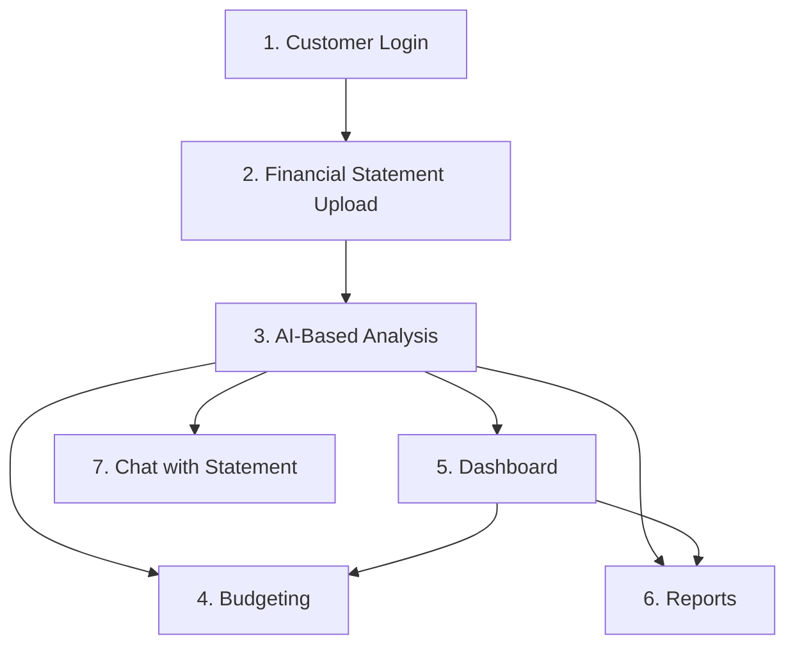
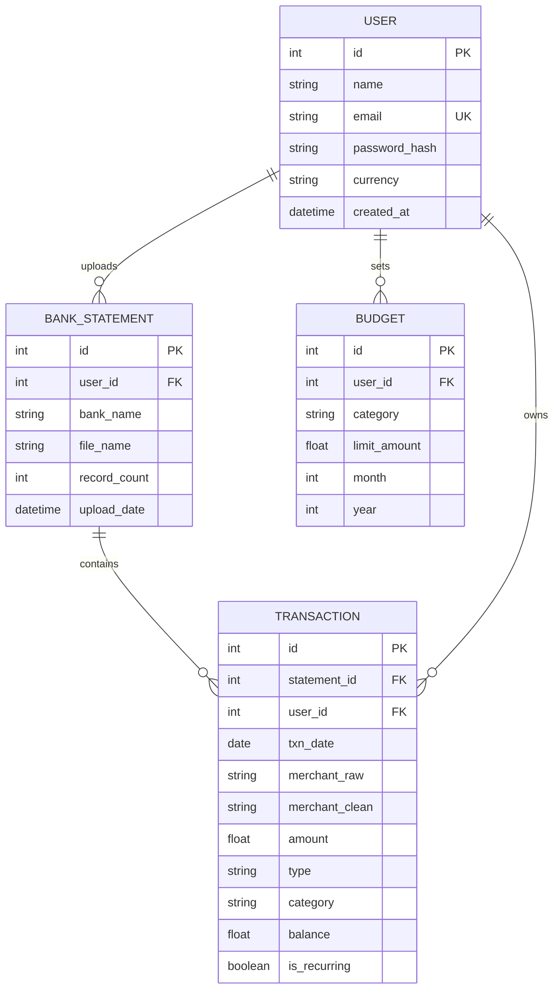

# PlainPocket — Implementation Plan

> **Goal**: Build a FinTech personal expense tracking web application that aggregates scattered bank statement data into a single, plain-language dashboard with AI-powered insights.

## Problem Statement

Individuals lose control over spending because transactions are scattered across UPI apps, cards, wallets, and subscriptions, with no single, simple view of everyday expenses in plain language.

---

## Module Architecture (7 Modules)



| # | Module | Complexity | Priority |
|---|--------|-----------|----------|
| 1 | **Customer Login** | 🟢 Low | Phase 1 |
| 2 | **Financial Statement Upload** | 🟡 Medium | Phase 1 |
| 3 | **AI-Based Financial Analysis** | 🔴 High | Phase 2 |
| 4 | **Budgeting** | 🟡 Medium | Phase 3 |
| 5 | **Dashboard** | 🟡 Medium | Phase 2 |
| 6 | **Reports** | 🟡 Medium | Phase 3 |
| 7 | **Chat with Financial Statement** | 🔴 High | Phase 4 |

---

## User Review Required

> [!IMPORTANT]
> **Tech Stack Decision**: I propose building this as a **full-stack web app** using the following stack. Please confirm or suggest changes:
> - **Frontend**: React (Vite) with Chart.js for visualizations
> - **Backend**: Python (Flask/FastAPI)
> - **Database**: SQLite (for intern simplicity, easily swappable to PostgreSQL)
> - **AI/LLM**: Google Gemini API for categorization and chat
> - **Auth**: JWT-based authentication

> [!IMPORTANT]
> **Scope Clarification**: Since this is an intern-level project, I recommend:
> - Starting with **CSV uploads only** (no PDF parsing — that adds OCR complexity)
> - Using **Gemini API** for the AI engine rather than training a custom ML model
> - Keeping it a **web app** (not mobile) to reduce scope

> [!WARNING]
> **API Key Required**: The AI modules (3 and 7) require a **Google Gemini API key**. You'll need to provide one or we can mock the AI responses for demo purposes.

---

## Open Questions

1. **Gemini API Key**: Do you have a Google Gemini API key, or should I build the AI modules with a mock/fallback mode?
2. **Deployment**: Do you want Docker support (you have Docker experience from your Loan Approval System), or is local-only fine for now?
3. **Bank Focus**: Should we support all 4 banks (HDFC, SBI, ICICI, AXIS) from day one, or start with 2?
4. **Authentication**: Simple JWT auth, or do you want Google/GitHub OAuth as well?

---

## Proposed Changes

### Tech Stack & Directory Structure

```
PlainPocket/
├── frontend/                   # React (Vite) app
│   ├── public/
│   ├── src/
│   │   ├── assets/             # Icons, images, fonts
│   │   ├── components/         # Reusable UI components
│   │   │   ├── common/         # Buttons, Cards, Modals, Loaders
│   │   │   ├── charts/         # Chart components (Pie, Line, Bar)
│   │   │   └── layout/         # Navbar, Sidebar, Footer
│   │   ├── pages/              # Route-level pages
│   │   │   ├── Login.jsx
│   │   │   ├── Dashboard.jsx
│   │   │   ├── Upload.jsx
│   │   │   ├── Budgeting.jsx
│   │   │   ├── Reports.jsx
│   │   │   └── Chat.jsx
│   │   ├── context/            # Auth context, Theme context
│   │   ├── services/           # API call functions
│   │   ├── utils/              # Helpers, formatters
│   │   ├── App.jsx
│   │   ├── App.css
│   │   ├── index.css           # Global design system
│   │   └── main.jsx
│   ├── package.json
│   └── vite.config.js
│
├── backend/                    # Python Flask/FastAPI
│   ├── app/
│   │   ├── __init__.py
│   │   ├── auth/               # Login, signup, JWT
│   │   │   ├── routes.py
│   │   │   └── models.py
│   │   ├── upload/             # File upload & parsing
│   │   │   ├── routes.py
│   │   │   ├── parsers/        # Bank-specific CSV parsers
│   │   │   │   ├── hdfc.py
│   │   │   │   ├── sbi.py
│   │   │   │   ├── icici.py
│   │   │   │   └── axis.py
│   │   │   └── models.py
│   │   ├── analysis/           # AI categorization engine
│   │   │   ├── routes.py
│   │   │   ├── categorizer.py  # Gemini-powered categorization
│   │   │   ├── merchant_cleaner.py
│   │   │   └── subscription_detector.py
│   │   ├── budget/             # Budgeting logic
│   │   │   ├── routes.py
│   │   │   └── models.py
│   │   ├── dashboard/          # Dashboard aggregation
│   │   │   └── routes.py
│   │   ├── reports/            # Report generation
│   │   │   ├── routes.py
│   │   │   └── pdf_generator.py
│   │   ├── chat/               # LLM chat with statements
│   │   │   ├── routes.py
│   │   │   └── rag_engine.py
│   │   └── db.py               # Database connection & init
│   ├── config.py
│   ├── requirements.txt
│   └── run.py
│
├── data/                       # Dummy CSV statements for testing
│   ├── HDFC_Dummy_Statement.csv
│   ├── SBI_Dummy_Statement.csv
│   ├── ICICI_Dummy_Statement.csv
│   └── AXIS_Dummy_Statement.csv
│
├── scripts/                    # Utility scripts
│   └── generate_dummy_data.py
│
└── README.md
```

---

### Module 1: Customer Login (Identity & Security)

#### [NEW] [routes.py](file:///c:/Users/dhruv/OneDrive/Documents/PlainPocket/backend/app/auth/routes.py)
- `POST /api/auth/signup` — Register with name, email, password (hashed with bcrypt)
- `POST /api/auth/login` — Returns JWT access token
- `GET /api/auth/me` — Returns current user profile
- JWT middleware for protected routes

#### [NEW] [models.py](file:///c:/Users/dhruv/OneDrive/Documents/PlainPocket/backend/app/auth/models.py)
- `User` table: id, name, email, password_hash, currency (INR), created_at

#### [NEW] [Login.jsx](file:///c:/Users/dhruv/OneDrive/Documents/PlainPocket/frontend/src/pages/Login.jsx)
- Beautiful login/signup form with glassmorphism design
- Form validation, error states, loading animations
- JWT stored in localStorage with auth context

---

### Module 2: Financial Statement Upload (Data Ingestor)

#### [NEW] [routes.py](file:///c:/Users/dhruv/OneDrive/Documents/PlainPocket/backend/app/upload/routes.py)
- `POST /api/upload/statement` — Accepts CSV file + bank name
- Auto-detects bank format from CSV headers
- Parses & normalizes into unified transaction schema
- Deduplication check before inserting

#### [NEW] Bank Parsers (`hdfc.py`, `sbi.py`, `icici.py`, `axis.py`)
- Each parser reads bank-specific column names and date formats
- Normalizes to: `{date, merchant_raw, merchant_clean, amount, type, balance, category, bank_name}`

#### [NEW] [models.py](file:///c:/Users/dhruv/OneDrive/Documents/PlainPocket/backend/app/upload/models.py)
- `BankStatement` table: id, user_id, bank_name, upload_date, file_name, record_count
- `Transaction` table: id, statement_id, user_id, date, merchant_raw, merchant_clean, amount, type (debit/credit), category, balance, is_recurring

#### [NEW] [Upload.jsx](file:///c:/Users/dhruv/OneDrive/Documents/PlainPocket/frontend/src/pages/Upload.jsx)
- Drag-and-drop zone with bank selection dropdown
- Upload progress bar with animated feedback
- Post-upload summary: "✅ 100 transactions imported from HDFC"

---

### Module 3: AI-Based Financial Analysis (The Engine)

#### [NEW] [merchant_cleaner.py](file:///c:/Users/dhruv/OneDrive/Documents/PlainPocket/backend/app/analysis/merchant_cleaner.py)
- Regex-based cleaning: strips UPI codes, gateway IDs, `@ok*` suffixes
- Example: `UPI-ZOMATO-PAY-@okaxis` → `Zomato`
- Lookup table for common merchants

#### [NEW] [categorizer.py](file:///c:/Users/dhruv/OneDrive/Documents/PlainPocket/backend/app/analysis/categorizer.py)
- **Level 1**: Keyword rules (`RECHARGE` → Utilities, `EMI` → Finance)
- **Level 2**: Gemini API call for unknown merchants
- Categories: Food, Groceries, Transport, Utilities, Entertainment, Shopping, Finance/EMI, Rent, Salary, Services, Subscriptions, Other
- User override: if user relabels, store mapping for future auto-apply

#### [NEW] [subscription_detector.py](file:///c:/Users/dhruv/OneDrive/Documents/PlainPocket/backend/app/analysis/subscription_detector.py)
- Scans for transactions with same merchant + similar amount recurring monthly
- Flags as `is_recurring = True`
- Calculates annual cost projection

---

### Module 4: Budgeting (Control Center)

#### [NEW] [routes.py](file:///c:/Users/dhruv/OneDrive/Documents/PlainPocket/backend/app/budget/routes.py)
- `POST /api/budget` — Set category-wise monthly budget
- `GET /api/budget/status` — Returns budget vs. actual per category
- `PUT /api/budget/:id` — Update a budget limit

#### [NEW] [models.py](file:///c:/Users/dhruv/OneDrive/Documents/PlainPocket/backend/app/budget/models.py)
- `Budget` table: id, user_id, category, limit_amount, month, year

#### [NEW] [Budgeting.jsx](file:///c:/Users/dhruv/OneDrive/Documents/PlainPocket/frontend/src/pages/Budgeting.jsx)
- Category cards with animated progress bars (spent / limit)
- Color-coded: 🟢 under 50%, 🟡 50-80%, 🔴 over 80%
- "Add Budget" modal with category picker and amount input

---

### Module 5: Dashboard (The Single View)

#### [NEW] [routes.py](file:///c:/Users/dhruv/OneDrive/Documents/PlainPocket/backend/app/dashboard/routes.py)
- `GET /api/dashboard/summary` — Total income, total expense, net balance
- `GET /api/dashboard/category-breakdown` — Spending by category
- `GET /api/dashboard/daily-trend` — Daily expense line chart data
- `GET /api/dashboard/top-merchants` — Top 5 spending merchants

#### [NEW] [Dashboard.jsx](file:///c:/Users/dhruv/OneDrive/Documents/PlainPocket/frontend/src/pages/Dashboard.jsx)
- **Hero Cards**: Total Income | Total Expenses | Net Savings (with animated counters)
- **Donut Chart**: Category-wise spending breakdown
- **Line Chart**: Daily burn rate over the month
- **Top Merchants**: Ranked list with merchant logos/icons
- **Subscription Alert**: "You have 3 active subscriptions costing ₹1,200/month"
- Dark mode glassmorphism design

---

### Module 6: Reports (Historical Archive)

#### [NEW] [routes.py](file:///c:/Users/dhruv/OneDrive/Documents/PlainPocket/backend/app/reports/routes.py)
- `GET /api/reports/monthly?month=3&year=2026` — Full monthly breakdown
- `GET /api/reports/comparison?m1=3&m2=4&year=2026` — Month-vs-month comparison
- `GET /api/reports/trends?months=6` — 6-month trend data
- `GET /api/reports/export/pdf` — Generate downloadable PDF

#### [NEW] [pdf_generator.py](file:///c:/Users/dhruv/OneDrive/Documents/PlainPocket/backend/app/reports/pdf_generator.py)
- Uses `reportlab` or `fpdf` to generate clean, branded PDF reports
- Includes summary table, category chart, and top expenses

#### [NEW] [Reports.jsx](file:///c:/Users/dhruv/OneDrive/Documents/PlainPocket/frontend/src/pages/Reports.jsx)
- Month selector with comparison mode toggle
- Bar chart: This month vs. last month by category
- Trend line: 6-month spending trajectory
- "Download PDF" button with loading state

---

### Module 7: Chat with Financial Statement (Plain Language Interface)

#### [NEW] [rag_engine.py](file:///c:/Users/dhruv/OneDrive/Documents/PlainPocket/backend/app/chat/rag_engine.py)
- Retrieves user's transaction data and formats as context
- Sends to Gemini API with system prompt: *"You are a financial assistant. Answer based only on the user's transaction data."*
- Handles queries like:
  - "How much did I spend on food this month?"
  - "Did I pay the electricity bill?"
  - "What's my biggest expense category?"

#### [NEW] [routes.py](file:///c:/Users/dhruv/OneDrive/Documents/PlainPocket/backend/app/chat/routes.py)
- `POST /api/chat` — Accepts user question, returns AI answer
- Maintains conversation history per session

#### [NEW] [Chat.jsx](file:///c:/Users/dhruv/OneDrive/Documents/PlainPocket/frontend/src/pages/Chat.jsx)
- Modern chat interface with message bubbles
- Typing indicator animation
- Suggested questions: "Try asking: 'What did I spend on Swiggy?'"
- Markdown rendering for AI responses (tables, lists)

---

## Database Schema (SQLite)



---

## UI Design Direction

- **Theme**: Dark mode with glassmorphism (frosted glass cards)
- **Color Palette**: 
  - Primary: `#6C63FF` (Electric Indigo)
  - Secondary: `#00D9A6` (Mint Green for positive/income)
  - Danger: `#FF6B6B` (Coral for overspending)
  - Background: `#0F0F1A` (Deep Navy)
  - Card Glass: `rgba(255, 255, 255, 0.05)` with backdrop blur
- **Typography**: Inter (Google Fonts)
- **Animations**: Framer Motion for page transitions and micro-interactions
- **Charts**: Chart.js with custom dark theme

---

## Phased Development Roadmap

### Phase 1 — Foundation (Week 1-2)
- [x] Project scaffold (Vite + Flask)
- [ ] Design system (CSS variables, global styles)
- [ ] Module 1: Customer Login (JWT auth)
- [ ] Module 2: File Upload + Bank Parsers
- [ ] Generate dummy CSV data for all 4 banks
- [ ] Database schema + migrations

### Phase 2 — Intelligence & Visualization (Week 3-4)
- [ ] Module 3: AI Analysis (merchant cleaning + categorization)
- [ ] Module 5: Dashboard (charts, summary cards)
- [ ] Connect upload → analysis → dashboard pipeline

### Phase 3 — Financial Tools (Week 5)
- [ ] Module 4: Budgeting (set limits, track progress)
- [ ] Module 6: Reports (comparisons, trends, PDF export)

### Phase 4 — AI Chat & Polish (Week 6)
- [ ] Module 7: Chat with Statement (Gemini RAG)
- [ ] UI polish, animations, responsive design
- [ ] End-to-end testing
- [ ] Deployment

---

## Verification Plan

### Automated Tests
- **Backend**: Run pytest for each API endpoint (auth, upload, analysis, budget, dashboard, reports, chat)
- **Parsers**: Unit test each bank parser with the 4 dummy CSVs
- **Categorizer**: Test with known merchant strings to verify correct category assignment

### Manual / Browser Verification
- **Upload Flow**: Upload each of the 4 bank CSVs and verify transactions appear correctly
- **Dashboard**: Verify charts render with real data
- **Chat**: Test 5+ natural language queries and verify accuracy
- **Reports**: Generate and download a PDF report, verify formatting
- **Responsive**: Test on mobile viewport (375px) and desktop (1440px)
